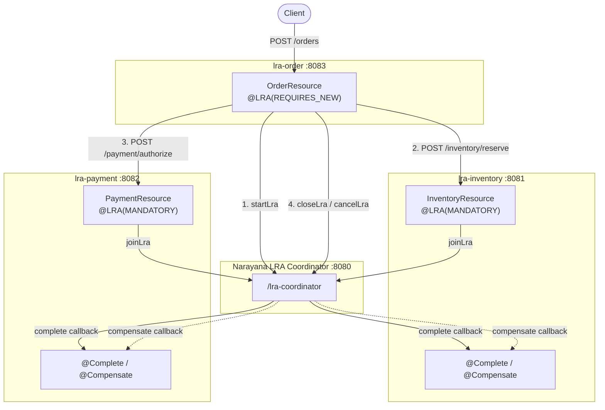
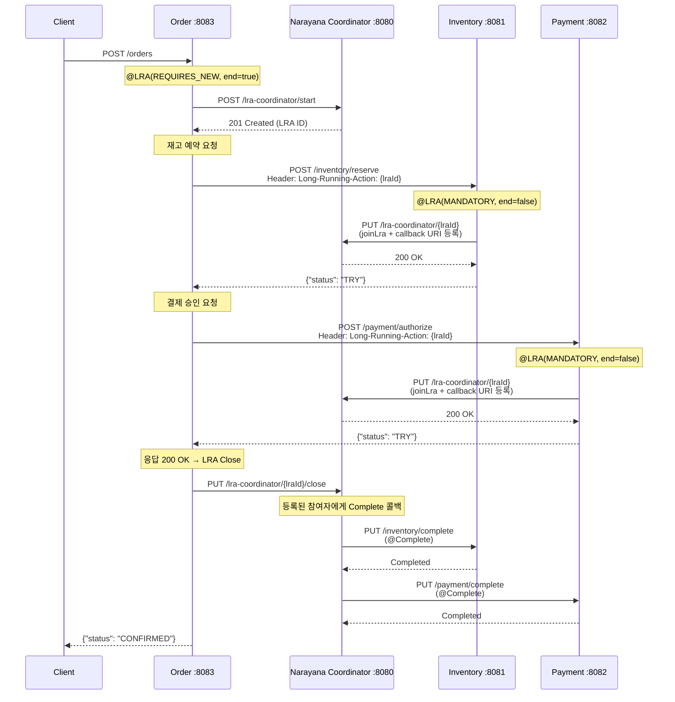
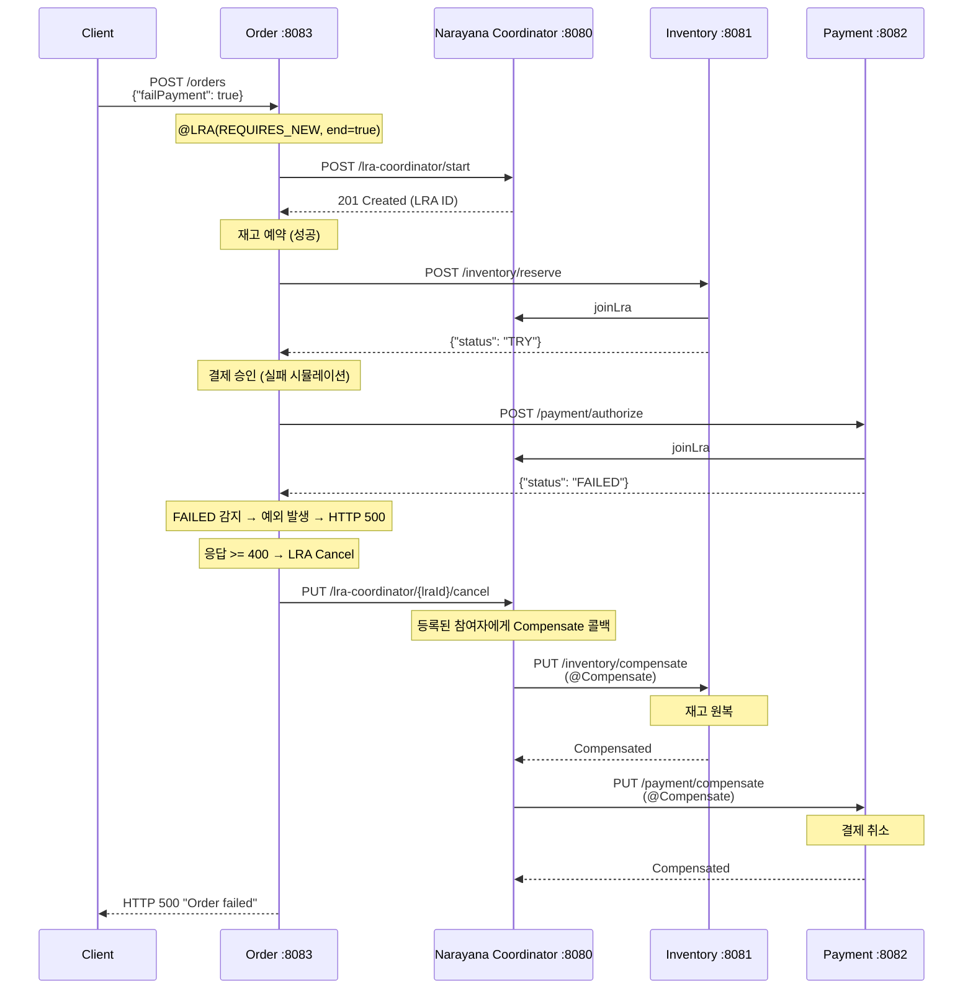

# MicroProfile LRA를 활용한 Saga 패턴 구현

---

## 1. MicroProfile LRA 소개

**LRA (Long Running Actions)** 는 Eclipse MicroProfile에서 정의한 Saga 패턴 표준 스펙이다.

- HTTP 기반 분산 트랜잭션 조정
- 표준 어노테이션으로 선언적 트랜잭션 관리
- 코디네이터가 참여자(Participant)의 Complete/Compensate 콜백을 자동 호출
- REST 마이크로서비스에 자연스럽게 통합

---

## 2. MicroProfile LRA 스펙 개요

### 핵심 개념

```
┌─────────────────┐       HTTP Header 전파       ┌──────────────┐
│   Initiator     │ ──────────────────────────▶  │  Participant  │
│  (Order 서비스)  │   Long-Running-Action: <id>  │ (Inventory)   │
└────────┬────────┘                              └──────┬───────┘
         │                                              │
         │  start / close / cancel                      │  join / complete / compensate
         ▼                                              ▼
┌─────────────────────────────────────────────────────────────┐
│                    LRA Coordinator (Narayana)                │
│               http://localhost:8080/lra-coordinator          │
└─────────────────────────────────────────────────────────────┘
```

- **Coordinator**: LRA 생명주기 관리 (시작/종료/취소), 참여자 콜백 호출
- **Initiator**: LRA를 시작하는 서비스 (오케스트레이터)
- **Participant**: LRA에 참여하여 Complete/Compensate 콜백을 구현하는 서비스

### 주요 어노테이션

| 어노테이션 | 역할 |
|-----------|------|
| `@LRA(Type.REQUIRES_NEW)` | 새로운 LRA 시작 (Initiator용) |
| `@LRA(Type.MANDATORY)` | 기존 LRA 컨텍스트 필수 (Participant용) |
| `@LRA(Type.REQUIRED)` | LRA 있으면 참여, 없으면 새로 시작 |
| `@Complete` | LRA 성공 시 호출되는 콜백 |
| `@Compensate` | LRA 실패 시 호출되는 보상 콜백 |
| `@Status` | 참여자의 현재 상태를 코디네이터에 보고 |

### LRA 컨텍스트 전파

```
Long-Running-Action: http://localhost:8080/lra-coordinator/0_ffffac110003_ae72_67a8b3c1_2
```

HTTP 헤더 `Long-Running-Action`을 통해 LRA ID가 서비스 간 전파된다.

---

## 3. 데모 프로젝트 아키텍처

### 서비스 구성도



### 기술 스택

| 항목 | 기술 |
|------|------|
| Framework | Spring Boot 3.2.2 |
| Language | Java 21 |
| REST | Jersey (JAX-RS) |
| LRA 스펙 | Eclipse MicroProfile LRA API 2.0 |
| LRA 구현체 | Narayana LRA 5.13.1.Final |
| DB | H2 In-Memory (PostgreSQL 모드) |
| Build | Gradle 8.10 (멀티모듈) |

### 프로젝트 구조

```
microProfile-LRA/
├── build.gradle              # 루트 빌드 설정 (공통 의존성)
├── settings.gradle           # include 'lra-order', 'lra-inventory', 'lra-payment'
├── lra-order/                # Initiator (오케스트레이터)
│   └── src/main/java/com/example/lra_order/
│       ├── resource/OrderResource.java
│       ├── lra/LraRequestFilter.java
│       ├── lra/LraCoordinatorClient.java
│       └── dto/OrderRequest.java, OrderResponse.java
├── lra-inventory/            # Participant (재고)
│   └── src/main/java/com/example/lra_inventory/
│       ├── resource/InventoryResource.java
│       ├── lra/LraRequestFilter.java
│       └── dto/InventoryRequest.java, InventoryResponse.java
└── lra-payment/              # Participant (결제)
    └── src/main/java/com/example/lra_payment/
        ├── resource/PaymentResource.java
        ├── lra/LraRequestFilter.java
        └── dto/PaymentRequest.java, PaymentResponse.java
```

---

## 4. 트랜잭션 흐름 상세

### 성공 시나리오



### 실패 시나리오 (결제 실패)



---

## 5. 핵심 구현 코드 설명

### 5.1 LraRequestFilter — LRA 생명주기 자동화

JAX-RS `ContainerRequestFilter` + `ContainerResponseFilter`를 구현하여
`@LRA` 어노테이션이 붙은 리소스 메서드의 LRA 생명주기를 자동으로 관리한다.

#### Request 필터: LRA 시작 / 참여

```java
// lra-order/src/main/java/com/example/lra_order/lra/LraRequestFilter.java

@Override
public void filter(ContainerRequestContext requestContext) {
    LRA lra = resolveLraAnnotation(resourceInfo);
    if (lra == null) return;

    URI lraId = readLraId(requestContext);
    switch (lra.value()) {
        case REQUIRES_NEW -> {
            // 새 LRA 시작 (Initiator)
            URI started = lraClient.startLra(
                resourceInfo.getResourceClass().getSimpleName(), lraId);
            requestContext.getHeaders()
                .putSingle(LRA_HTTP_CONTEXT_HEADER, started.toString());
            requestContext.setProperty(LRA_ID_PROPERTY, started);
            requestContext.setProperty(LRA_STARTED_PROPERTY, true);
            requestContext.setProperty(LRA_END_PROPERTY, lra.end());
        }
        case MANDATORY -> {
            // 기존 LRA 필수 (Participant)
            if (lraId == null) {
                throw new WebApplicationException(
                    "Missing LRA context", Response.Status.PRECONDITION_FAILED);
            }
            requestContext.setProperty(LRA_ID_PROPERTY, lraId);
            requestContext.setProperty(LRA_END_PROPERTY, false);
            joinIfParticipant(lraId);  // 코디네이터에 참여자 등록
        }
        // ...
    }
}
```

**핵심 포인트:**
- `REQUIRES_NEW`: 코디네이터에 새 LRA를 시작하고, 헤더에 LRA ID를 설정
- `MANDATORY`: 헤더에서 LRA ID를 읽고, 코디네이터에 참여자로 등록 (`joinLra`)

#### Response 필터: LRA 종료 / 취소

```java
// lra-order/src/main/java/com/example/lra_order/lra/LraRequestFilter.java

@Override
public void filter(ContainerRequestContext requestContext,
                   ContainerResponseContext responseContext) {
    boolean started = Boolean.TRUE.equals(
        requestContext.getProperty(LRA_STARTED_PROPERTY));
    boolean shouldEnd = Boolean.TRUE.equals(
        requestContext.getProperty(LRA_END_PROPERTY));
    if (!started || !shouldEnd) return;

    URI lraId = (URI) requestContext.getProperty(LRA_ID_PROPERTY);
    if (lraId == null) return;

    if (responseContext.getStatus() >= 400) {
        lraClient.cancelLra(lraId);   // 실패 → Compensate 트리거
    } else {
        lraClient.closeLra(lraId);    // 성공 → Complete 트리거
    }
}
```

**핵심 포인트:**
- HTTP 응답 코드 기반으로 LRA 종료 여부 결정
- `< 400`: Close (Complete 콜백 호출)
- `>= 400`: Cancel (Compensate 콜백 호출)

#### 콜백 URI 등록

```java
// lra-inventory/src/main/java/com/example/lra_inventory/lra/LraRequestFilter.java

private Map<String, URI> buildTerminationUris(String classPath) {
    UriBuilder base = UriBuilder.fromUri(externalBaseUri).path(classPath);
    Map<String, URI> uris = new HashMap<>();
    uris.put("compensate", base.clone().path("compensate").build());
    uris.put("complete",   base.clone().path("complete").build());
    uris.put("status",     base.clone().path("lra-status").build());
    uris.put("forget",     base.clone().path("forget").build());
    uris.put("leave",      base.clone().path("leave").build());
    uris.put("after",      base.clone().path("after").build());
    return uris;
}
```

> 참여자 서비스는 `app.base-url`로 `host.docker.internal`을 사용한다.
> Docker 컨테이너 내 Narayana가 호스트의 서비스에 콜백을 보낼 수 있도록 하기 위함이다.

---

### 5.2 LraCoordinatorClient — Narayana REST API 래퍼

```java
// lra-order/src/main/java/com/example/lra_order/lra/LraCoordinatorClient.java

@Component
public class LraCoordinatorClient {

    // LRA 시작
    public URI startLra(String clientId, URI parentLra) {
        try (Response response = client.target(coordinatorUrl)
                .path("/start")
                .queryParam("ClientID", resolvedClientId)
                .queryParam("TimeLimit", 0)
                .queryParam("ParentLRA", parent)
                .request()
                .header("Narayana-LRA-API-version", "1.0")
                .post(null)) {
            // 201 Created → Location 헤더에 LRA ID 반환
            return URI.create(response.getHeaderString("Location"));
        }
    }

    // LRA 참여 (콜백 URI를 Link 헤더로 전달)
    public URI joinLra(URI lraId, Map<String, URI> terminationUris,
                       String participantData) {
        String linkHeader = buildLinkHeader(terminationUris);
        try (Response response = client.target(coordinatorUrl)
                .path("/" + lraUid(lraId))
                .request()
                .header("Link", linkHeader)     // 콜백 URI 등록
                .put(Entity.text(payload))) {
            return recovery != null ? URI.create(recovery) : lraId;
        }
    }

    // LRA 종료/취소
    private void endLra(URI lraId, String action) {
        // PUT /lra-coordinator/{lraUid}/close  또는
        // PUT /lra-coordinator/{lraUid}/cancel
        client.target(coordinatorUrl)
            .path("/" + lraUid(lraId) + "/" + action)
            .request()
            .put(Entity.text(""));
    }

    // Link 헤더 빌드: <http://host:8081/inventory/compensate>; rel="compensate", ...
    private String buildLinkHeader(Map<String, URI> terminationUris) {
        StringJoiner joiner = new StringJoiner(",");
        for (Map.Entry<String, URI> entry : terminationUris.entrySet()) {
            Link link = Link.fromUri(entry.getValue())
                    .rel(entry.getKey())
                    .title(entry.getKey())
                    .type("text/plain")
                    .build();
            joiner.add(link.toString());
        }
        return joiner.toString();
    }
}
```

**Narayana REST API 요약:**

| 동작 | HTTP 메서드 | 엔드포인트 |
|------|------------|-----------|
| LRA 시작 | `POST` | `/lra-coordinator/start` |
| 참여자 등록 | `PUT` | `/lra-coordinator/{lraId}` |
| LRA 종료 (성공) | `PUT` | `/lra-coordinator/{lraId}/close` |
| LRA 취소 (실패) | `PUT` | `/lra-coordinator/{lraId}/cancel` |

---

### 5.3 OrderResource — 오케스트레이터

```java
// lra-order/src/main/java/com/example/lra_order/resource/OrderResource.java

@Component
@Path("/orders")
public class OrderResource {

    @POST
    @LRA(value = LRA.Type.REQUIRES_NEW, end = true)  // 새 LRA 시작, 응답 시 자동 종료
    public OrderResponse createOrder(OrderRequest request,
                                     @HeaderParam(LRA_HTTP_CONTEXT_HEADER) URI lraId) {
        String orderId = Optional.ofNullable(request.orderId())
            .orElseGet(() -> UUID.randomUUID().toString());
        OrderEntity entity = new OrderEntity(orderId, "PENDING", toJson(request));
        entity.setLraId(lraId.toString());
        orderRepository.save(entity);

        try {
            // 1) 재고 예약
            InventoryRequest invReq = new InventoryRequest(
                orderId, request.items(), request.failInventory());
            InventoryResponse invResp = callParticipant(
                inventoryBaseUrl + "/inventory/reserve", lraId, invReq);
            if ("FAILED".equalsIgnoreCase(invResp.status())) {
                throw new WebApplicationException("Inventory reservation failed");
            }

            // 2) 결제 승인
            PaymentRequest payReq = new PaymentRequest(
                orderId, request.amount(), request.failPayment());
            PaymentResponse payResp = callParticipant(
                paymentBaseUrl + "/payment/authorize", lraId, payReq);
            if ("FAILED".equalsIgnoreCase(payResp.status())) {
                throw new WebApplicationException("Payment authorization failed");
            }

            entity.setStatus("CONFIRMED");
            orderRepository.save(entity);
            return new OrderResponse(orderId, "CONFIRMED", ...);

        } catch (Exception ex) {
            entity.setStatus("CANCELLED");
            orderRepository.save(entity);
            // 예외 → HTTP 500 → ResponseFilter가 cancelLra 호출
            throw new WebApplicationException("Order failed",
                Response.Status.INTERNAL_SERVER_ERROR);
        }
    }
}
```

**핵심 포인트:**
- `@LRA(REQUIRES_NEW, end=true)`: 메서드 진입 시 새 LRA 시작, 응답 시 자동 종료
- 참여자 호출 시 `Long-Running-Action` 헤더로 LRA ID 전파
- 응답의 `status` 필드로 비즈니스 실패 감지 (HTTP 200이지만 논리적 실패)
- 예외 발생 → HTTP 500 → Response 필터가 `cancelLra` 호출 → Compensate 트리거

---

### 5.4 InventoryResource — 참여자 (Complete / Compensate)

```java
// lra-inventory/src/main/java/com/example/lra_inventory/resource/InventoryResource.java

@Component
@Path("/inventory")
public class InventoryResource {

    @POST
    @Path("/reserve")
    @LRA(value = LRA.Type.MANDATORY, end = false)  // 기존 LRA 필수, 종료하지 않음
    public InventoryResponse reserve(InventoryRequest request,
                                     @HeaderParam(LRA_HTTP_CONTEXT_HEADER) URI lraId) {
        String status = request.fail() ? "FAILED" : "TRY";
        InventoryReservation reservation = new InventoryReservation(
            request.orderId(), lraId.toString(), status, toJson(request));
        repository.save(reservation);
        return new InventoryResponse(request.orderId(), status, lraId.toString());
    }

    @PUT
    @Path("/complete")
    @Complete                    // LRA 성공 시 Narayana가 호출
    public Response complete(@HeaderParam(LRA_HTTP_CONTEXT_HEADER) URI lraId) {
        InventoryReservation reservation = findByLra(lraId);
        reservation.setStatus("COMPLETED");  // TRY → COMPLETED (확정)
        repository.save(reservation);
        return Response.ok(ParticipantStatus.Completed.name()).build();
    }

    @PUT
    @Path("/compensate")
    @Compensate                  // LRA 실패 시 Narayana가 호출
    public Response compensate(@HeaderParam(LRA_HTTP_CONTEXT_HEADER) URI lraId) {
        InventoryReservation reservation = findByLra(lraId);
        reservation.setStatus("COMPENSATED");  // TRY → COMPENSATED (원복)
        repository.save(reservation);
        return Response.ok(ParticipantStatus.Compensated.name()).build();
    }

    @GET
    @Path("/lra-status")
    @Status                      // Narayana가 참여자 상태 확인 시 호출
    public Response lraStatus(@HeaderParam(LRA_HTTP_CONTEXT_HEADER) URI lraId) {
        InventoryReservation reservation = findByLra(lraId);
        String status = switch (reservation.getStatus()) {
            case "COMPLETED"   -> ParticipantStatus.Completed.name();
            case "COMPENSATED" -> ParticipantStatus.Compensated.name();
            case "FAILED", "TRY" -> ParticipantStatus.Active.name();
            default -> ParticipantStatus.Active.name();
        };
        return Response.ok(status).build();
    }
}
```

**참여자 상태 전이:**

```
TRY ──(LRA Close)──▶ COMPLETED    ← @Complete 콜백
TRY ──(LRA Cancel)──▶ COMPENSATED ← @Compensate 콜백
```

> PaymentResource도 동일한 패턴으로 구현되어 있다.

---

### 5.5 DTO — Java Record

```java
// lra-order/src/main/java/com/example/lra_order/dto/OrderRequest.java
public record OrderRequest(
    String orderId,
    List<OrderItem> items,
    BigDecimal amount,
    boolean failInventory,   // 재고 실패 시뮬레이션 플래그
    boolean failPayment      // 결제 실패 시뮬레이션 플래그
) {}

// lra-inventory/src/main/java/com/example/lra_inventory/dto/InventoryRequest.java
public record InventoryRequest(
    String orderId,
    List<InventoryItem> items,
    boolean fail             // 실패 시뮬레이션 플래그
) {}

// lra-payment/src/main/java/com/example/lra_payment/dto/PaymentRequest.java
public record PaymentRequest(
    String orderId,
    BigDecimal amount,
    boolean fail             // 실패 시뮬레이션 플래그
) {}
```

---

## 6. 실행 방법 (데모 가이드)

### Step 1: Narayana LRA Coordinator 실행

```bash
docker run --rm --name lra-coordinator \
  --add-host=host.docker.internal:host-gateway \
  -p 8080:8080 \
  -e QUARKUS_HTTP_ACCESS_LOG_ENABLED=true \
  -e QUARKUS_LOG_LEVEL=INFO \
  quay.io/jbosstm/lra-coordinator
```

> `--add-host=host.docker.internal:host-gateway` : Docker 컨테이너에서 호스트의 서비스로 콜백 가능하게 설정

### Step 2: 서비스 실행 (각각 별도 터미널)

```bash
./gradlew :lra-inventory:bootRun   # :8081
./gradlew :lra-payment:bootRun     # :8082
./gradlew :lra-order:bootRun       # :8083
```

### Step 3: 성공 시나리오 테스트

```bash
curl -X POST http://localhost:8083/orders \
  -H "Content-Type: application/json" \
  -d '{
    "orderId": "order-001",
    "items": [{"sku": "ITEM-A", "quantity": 2}],
    "amount": 50000,
    "failInventory": false,
    "failPayment": false
  }'
```

**기대 응답:**
```json
{
  "orderId": "order-001",
  "status": "CONFIRMED",
  "lraId": "http://localhost:8080/lra-coordinator/0_ffffac110003_...",
  "inventoryStatus": "RESERVED",
  "paymentStatus": "AUTHORIZED"
}
```

### Step 4: 실패 시나리오 테스트 (결제 실패 → 보상)

```bash
curl -X POST http://localhost:8083/orders \
  -H "Content-Type: application/json" \
  -d '{
    "orderId": "order-002",
    "items": [{"sku": "ITEM-B", "quantity": 1}],
    "amount": 30000,
    "failInventory": false,
    "failPayment": true
  }'
```

**결과:**
- Order: HTTP 500 응답 (주문 실패)
- 로그에서 `Inventory compensate callback` 확인 → 재고 원복 완료
- 로그에서 `Payment compensate callback` 확인 → 결제 보상 완료

### Step 5: 재고 실패 시나리오 테스트

```bash
curl -X POST http://localhost:8083/orders \
  -H "Content-Type: application/json" \
  -d '{
    "orderId": "order-003",
    "items": [{"sku": "ITEM-C", "quantity": 5}],
    "amount": 100000,
    "failInventory": true,
    "failPayment": false
  }'
```

### Step 6: 상태 확인

```bash
# 주문 상태 조회
curl http://localhost:8083/orders/order-001

# 재고 상태 조회
curl http://localhost:8081/inventory/status/order-001

# 결제 상태 조회
curl http://localhost:8082/payment/status/order-001
```

### H2 콘솔로 DB 직접 확인

| 서비스 | URL | JDBC URL |
|--------|-----|----------|
| Order | http://localhost:8083/h2-console | `jdbc:h2:mem:lra_order` |
| Inventory | http://localhost:8081/h2-console | `jdbc:h2:mem:lra_inventory` |
| Payment | http://localhost:8082/h2-console | `jdbc:h2:mem:lra_payment` |

---

## 참고 자료

- [Eclipse MicroProfile LRA Spec](https://download.eclipse.org/microprofile/microprofile-lra-2.0/microprofile-lra-spec-2.0.html)
- [Narayana LRA Documentation](https://narayana.io/docs/project/index.html)
- [Narayana LRA Coordinator Docker Image](https://quay.io/repository/jbosstm/lra-coordinator)
